# PTX Operating System (PTX OS) — Ultimate Architecture Blueprint v3.0

**Visionary Authority**: Ren — Chief Product & Architecture Officer  
**Architecture Classification**: Operating System & Self-Governed Engineering Platform  
**Target Milestone**: PTX Summer Cup 2026 Public Beta ➔ Multi-Tournament / Multi-Organization Community OS Expansion  

---

## 🏛️ 1. ARCHITECTURE TOPOLOGY & 6-TIER OPERATING SYSTEM LAYERS

```mermaid
graph TD
    subgraph Experience ["1. Experience Layer"]
        Web["Web Portal"]
        Mobile["Mobile App"]
        Admin["Admin Portal"]
        Copilot["AI Copilot Interface"]
    end

    subgraph Application ["2. Application Layer"]
        TournamentApp["Tournament App"]
        RegistrationApp["Registration App"]
        SchedulingApp["Scheduling App"]
        RefereeApp["Referee Console"]
        StandingsApp["Standings & Stats"]
        LiveCenter["Live Match Center"]
    end

    subgraph Domain ["3. Domain Layer"]
        TournamentDomain["Tournament Domain"]
        PlayerDomain["Player Domain"]
        TeamDomain["Team Domain"]
        MatchDomain["Match Domain"]
        MediaDomain["Media Domain"]
    end

    subgraph Platform ["4. Platform Layer"]
        Identity["Identity & RBAC"]
        Workflow["Workflow Engine"]
        Audit["Audit Engine"]
        Policy["Policy Engine"]
        Realtime["Realtime Engine"]
    end

    subgraph Knowledge ["5. Knowledge & DSL Layer"]
        BusinessRules["Business Rules DSL"]
        CapabilityModel["Capability Model"]
        KnowledgeGraph["Architecture Knowledge Graph"]
        AuditDSL["Audit DSL"]
    end

    subgraph CoreEngine ["6. PTX Core Engine"]
        RuleEng["Rule Engine"]
        PolicyEng["Policy Engine"]
        WorkflowEng["Workflow Engine"]
        AuditEng["Audit Engine"]
        KnowledgeEng["Knowledge Engine"]
        AiRuntime["AI Multi-Agent Runtime"]
    end

    Experience --> Application
    Application --> Domain
    Domain --> Platform
    Platform --> Knowledge
    Knowledge --> CoreEngine
```



---

## ⚙️ 2. PTX CORE ENGINE (`src/core/`) SPECIFICATION

1. **Rule Engine (`rule-engine.ts`)**: Evaluates declarative win/draw/loss points, ranking tie-breakers, and yellow/red card suspension rules directly from configuration.
2. **Policy Engine (`policy-engine.ts`)**: Enforces architecture topology rules (e.g. `UI cannot import Repository`) at CI/PR time.
3. **Workflow Engine (`workflow-engine.ts`)**: Manages tournament lifecycle states (`Registration ➔ Scheduling ➔ Playing ➔ Verification ➔ Standings ➔ Awards ➔ Archive`).
4. **Audit Engine (`audit-engine.ts`)**: Parses `AUDIT_MANIFEST.yaml`, evaluates evidences, and generates `PTX_ENTERPRISE_AUDIT_REPORT.md` automatically.
5. **Knowledge Engine (`knowledge-engine.ts`)**: Builds 7-tier Knowledge Graph (`Capability ➔ Business Rule ➔ API Contract ➔ Implementation ➔ Test ➔ Evidence ➔ Release`) for automated Impact Analysis.
6. **AI Runtime Platform (`ai-runtime-platform.ts`)**: Coordinates specialized AI agents (AI Architect, AI Reviewer, AI Auditor, AI QA, AI Release Manager).

---

## 📜 3. PTX DECLARATIVE DSL & COMPILER SPECIFICATION

```yaml
# ptx.dsl.yaml
version: "3.0.0"
operatingSystem: "PTX_OS"
domain: "PTX_SUMMER_CUP_2026"

rules:
  points:
    win: 3
    draw: 1
    loss: 0
  tieBreakers:
    - "POINTS"
    - "GOAL_DIFFERENCE"
    - "GOALS_FOR"
    - "HEAD_TO_HEAD"

workflow:
  states:
    - "REGISTRATION"
    - "SCHEDULING"
    - "PLAYING"
    - "VERIFICATION"
    - "STANDINGS"
    - "AWARDS"
    - "ARCHIVE"

policies:
  architecture:
    - rule: "UI_CANNOT_IMPORT_REPOSITORY"
      severity: "ERROR"
    - rule: "DOMAIN_CANNOT_IMPORT_REACT"
      severity: "ERROR"

release:
  channel: "BETA"
  decision: "RC1_APPROVED"
```
